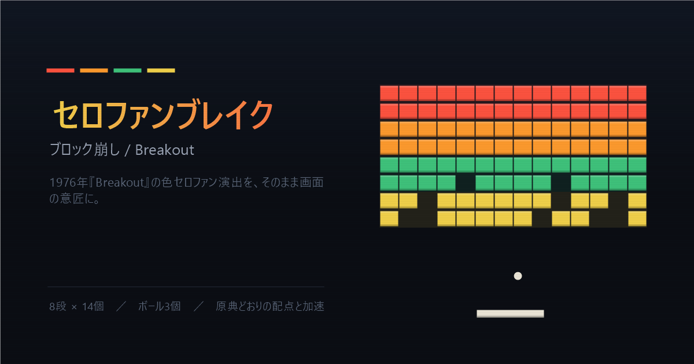

# セロファンブレイク

ブラウザで遊べるブロック崩し。依存ライブラリなし、HTML1ファイル（Canvas 2D + Vanilla JS）で動きます。

**▶ [遊ぶ](https://uchiyama-noritaka.github.io/game001/)**



## 由来

1976年の『Breakout』は白黒モニターに色つきセロファンを貼って段ごとの色を出していました。本作でもその「帯」をブロックの下に敷いてあり、崩したあとも帯だけが画面に残ります。どこまで削ったかが色で読めます。

## ルール

原典の挙動に合わせています。

| 段 | 得点 |
|---|---|
| 赤帯 | 7 pt |
| 橙帯 | 5 pt |
| 緑帯 | 3 pt |
| 黄帯 | 1 pt |

- 8段 × 14個、ボール3個
- 4打目・12打目で加速。橙帯と赤帯は最初の一撃でさらに加速（全5段階）
- 天井に当てるとパドルが半分の幅になる
- パドルのどこに当てたかで反射角が決まる（最大 ±65°）
- 全消しで次ラウンド（ボーナス50点、初速も少し上がる）
- ハイスコアは `localStorage` に保存

## 操作

| | |
|---|---|
| パドル | マウス / ← → / A D |
| 発射 | Space / クリック |
| 一時停止 | P |
| やり直し | R |

## 開発

ビルド不要です。`index.html` をブラウザで開けばそのまま動きます。

```
index.html   ゲーム本体（HTML / CSS / JS すべて内包）
og.png       OGP用の画像 1200×630
```
